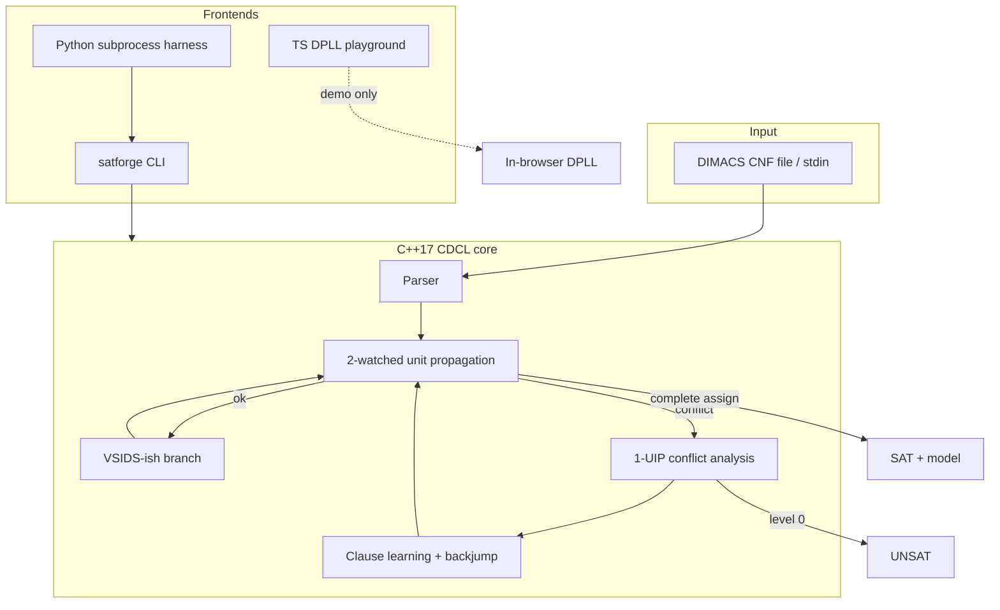

# satforge

**Educational CDCL SAT solver** — unit propagation, 1-UIP clause learning, and VSIDS-style branching in a readable C++17 core, with Python tests and a TypeScript playground.

[](https://github.com/SK090347/satforge/actions/workflows/ci.yml)
[](LICENSE)

> Author: **Sumit Kumar Ta (SK090347)** · Dual license **MIT OR Apache-2.0**

---

## Mathematics / Formulation

Boolean SAT asks for an assignment $x \in \{0,1\}^n$ that satisfies a CNF formula

$$
\phi = \bigwedge_{c \in C} \bigvee_{\ell \in c} \ell
$$

where each clause $c$ is a disjunction of literals. CDCL explores the search space by **deciding** free variables, **propagating** forced units, and **learning** asserting clauses from conflicts.

### Unit propagation

A clause with all but one literal falsified forces that last literal:

$$
(\ell_1 \lor \cdots \lor \ell_k),\quad \neg\ell_1,\ldots,\neg\ell_{k-1}\ \models\ \ell_k
$$

Two-watched-literal schemes detect units without scanning every clause on every assign.

### Conflict analysis (1-UIP)

From a conflict clause, resolve backwards along the implication graph until a **unique implication point** (UIP) remains on the current decision level. The learnt clause $\gamma$ is asserting: after backjump it unit-propagates a new assignment. In practice the search cost tracks the number of conflicts (heuristic-dependent); worst-case SAT remains **NP-complete**.

### Complexity & what is computed

| Quantity | Role |
|----------|------|
| Decisions / conflicts | Search effort counters |
| Learnt clauses | Compact conflict summaries |
| Activity (VSIDS-ish) | Branch heuristic — bump on conflict, decay over time |
| Model / UNSAT | Satisfying assignment, or proof that none exists |

**Why this formula?** Unit propagation + 1-UIP learning is the industrial CDCL core (MiniSat lineage). Implementing watched literals and asserting clauses makes the solver’s math tangible for algorithms / PL interviews.

---

## Why this exists

Boolean satisfiability is the canonical NP-complete problem and the engine behind modern verification, planning, and synthesis. Reading about CDCL is necessary; **implementing** watched literals, 1-UIP learning, and activity-based branching is what makes compilers / PL / algorithms interviews click.

`satforge` packages:

1. A **C++17 CDCL core** you can read like a teaching lab.
2. A **Python harness** (`pytest` via subprocess CLI) for sat/unsat fixtures.
3. A **TypeScript + HTML playground** with an in-browser DPLL for demos when WASM is unavailable.

---

## Quick start

```bash
# Build the CLI
cmake -S . -B build -DCMAKE_BUILD_TYPE=Release
cmake --build build -j
# or: make build

./build/satforge examples/sat_simple.cnf
# s SATISFIABLE
# v -1 2 0

./build/satforge examples/unsat_simple.cnf
# s UNSATISFIABLE

# C++ + Python tests
make test
# or:
ctest --test-dir build --output-on-failure
SATFORGE_BIN=$PWD/build/satforge python3 -m pytest python/tests -q
```

Exit codes follow the SAT competition convention: **10** = SAT, **20** = UNSAT.

### Web playground

```bash
cd web && npm install && npm run build
# open index.html in a browser (module loads dist/main.js)
```

The browser uses a tiny **TypeScript DPLL**. The flagship engine remains the C++ CDCL binary.
Optional Emscripten WASM notes live in [`web/README.md`](web/README.md).

---

## Architecture



### Core layout

```
include/satforge/   types, parser, solver API
src/                parser.cpp, solver.cpp, main.cpp
python/satforge/    CLI wrapper
python/tests/       pytest sat/unsat integration
web/src/            TypeScript DPLL + UI glue
examples/           tiny DIMACS fixtures
tests/cpp/          native smoke tests
```

### Algorithm sketch

| Piece | Role |
|-------|------|
| **Watched literals** | Lazy unit detection without scanning every clause |
| **Trail + levels** | Chronological assignment stack for undo |
| **1-UIP learning** | Derive asserting clause from conflict graph |
| **Backjump** | Undo to second-highest level in learnt clause |
| **Activity (VSIDS-ish)** | Bump vars on conflict; decay; pick max undef |

---

## DIMACS example

```text
c (x1 ∨ x2) ∧ (¬x1 ∨ x2)  →  forces x2
p cnf 2 2
1 2 0
-1 2 0
```

```bash
$ ./build/satforge examples/sat_simple.cnf --stats
s SATISFIABLE
v -1 2 0
c decisions=… propagations=… conflicts=… learnt=…
```

---

## Skills this demonstrates

- **Algorithms**: search, implication graphs, heuristics (NP-complete solvers)
- **Compilers / PL**: CNF as an IR; watched structures akin to pattern matching
- **Systems**: C++17, CMake, CLI contracts, CI matrix
- **Polyglot**: Python test harness + TypeScript educational UI

---

## License

Dual-licensed under **MIT** and **Apache-2.0**. See [`LICENSE`](LICENSE),
[`LICENSE-APACHE`](LICENSE-APACHE), and [`NOTICE`](NOTICE).

---

## Topics

`sat-solver` · `cdcl` · `cpp` · `python` · `typescript` · `algorithms` · `portfolio`
